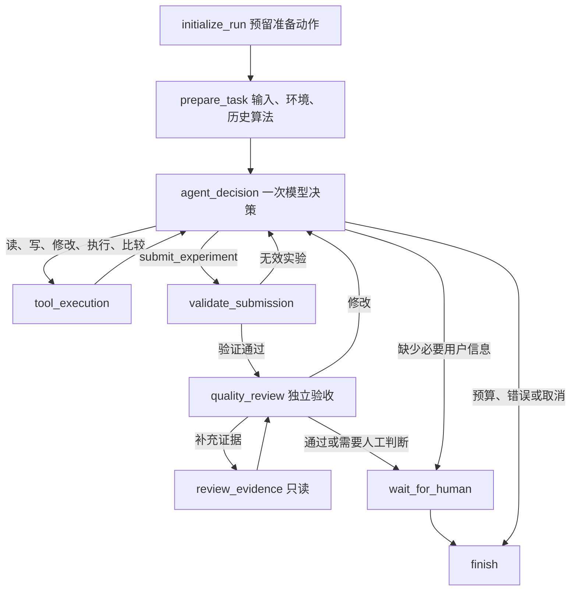

# 显式 LangGraph 工具 Agent

用户要求 Agent 自主决定查询、编辑、执行、比较及提交的顺序，同时让业务职责直接显示在 LangGraph 图中。
生产 provider 的 `agent_action` 进入 version 2；不存在内层 PlanningSession 或第二套探索循环。

实际图还包含各节点的失败出口和网络重试边。`initialize_run` 负责首次动作预留，
`finish` 是显式终态节点。图的运行节点及边可通过 `build_agent_graph(...).get_graph()` 直接查看。

## Agent 自主的部分

每次返回一个 `{kind: "tool", tool: "工具名", arguments: {...}}`，或必要信息不足时的 `needs_input`。
Agent 自主决定算法、算子、参数、代码、工具调用顺序、比较对象和提交哪个实验。

| 工具 | 行为 |
| --- | --- |
| `query_operators` / `load_skill` | 读取准确算子定义或业务说明 |
| `create_draft` / `edit_draft` / `read_draft` | 保存版本、局部修改、读取源码；保存不自动执行 |
| `execute_pipeline` | 必须提供持久草稿 ID 和当前 revision；执行后返回 Agent |
| `inspect_experiment` / `inspect_artifact` | 读取报告、中间产物、原分辨率局部图 |
| `compare_candidates` | 比较同输入及约束下的两至三个已执行实验；像素变化不表示准确率 |
| `submit_experiment` | 提交本轮真实实验 ID；通过校验才进入独立验收 |

首次 `create_draft.arguments` 同时包含 `understanding`，之后任务契约冻结。
新一轮用户明确要求的修改仍需 source_quote 校验，不能为解决算法失败而放宽要求。
Agent 可以先做两次实验再比较，然后提交较早的成功实验；提交不会再运行算法。
已被独立验收拒绝的同一实验不能原样重复提交。执行额度用尽后仍可查证、比较和提交已有实验。
最短成功链路为四次模型调用：建草稿、请求执行、提交、独立验收；工具操作本身不另外调用模型。

## 程序强制的部分

保持默认 600 秒、10 次模型调用、3 次执行、单模型调用 120 秒，可由环境变量调整。
每次模型决策、独立验收、网络重试都消耗同一调用预算。工具调用次数受决策调用预算约束，
复查的只读请求一次最多五个；没有每次工具执行又创建一份探索预算。
执行预算在运行前预留，已开始的失败执行也计费；无效草稿不会消耗执行额度。
同作用域重复算法返回已有实验 ID，避免重复运行。无进展读取和重复工具错误有停止保护。

节点执行一个已预留动作，保存完成凭据，应用结果，再预留下一动作，返回 LangGraph 同步检查点。
下一节点只有在检查点提交后才能运行。动作耗时、错误、输入摘要和完成凭据复用现有机制。
同 task 文件锁、SQLite `durability='sync'`、原始绝对期限、结果完整性校验、Docker 遗留容器恢复均保留。
完成结果可重放；模型已发送但结果未知时保守停止，不重新发送。没有自动启动扫描或后台任务队列。

`validate_submission` 核对本轮实验身份、成功执行状态、验收拒绝状态、输入/契约作用域、
执行凭据、运行环境、Docker 镜像及产物 manifest 哈希。复查使用提交实验的源码和结果，
而不是 Agent 最近编辑但尚未执行的草稿。选择旧实验后继续执行使用独立的最大迭代序号，
不会覆盖已经存在的较新实验目录。

独立验收只允许读取证据，不允许编辑或执行算法。拒收返回问题给 Agent；通过仍需人工确认。
人工继续会结束当前中断，用户提交新文字/画布反馈后创建携带上下文的新 run。
浏览器断线仍取消当前请求；这次没有引入独立后台运行服务。

## 兼容及文件

- `core/agent_workflow.py`：新图、工具路由、实验比较与提交校验。
- `core/agent_protocol.py`：模型工具协议、参数校验和提示。
- `core/orchestration.py`：共享动作执行/恢复与 version 1 兼容图。
- `core/orchestration_runtime.py`：统一预算、期限、凭据、任务锁。
- `core/agent_graph.py`：UI/CLI 统一入口及按已保存版本恢复。

旧 version 1 检查点继续使用 controller/effect 图；只有 `propose_action` 的 provider 仍走该兼容图。
legacy provider 或显式预计算 understanding 保持原 legacy 图。不会在恢复时把旧 pending action
映射成另一种协议，也不会刷新额度和期限。

## 验证

`tests/test_tool_agent_graph.py` 覆盖真实 Docker 执行、显式提交、两次实验后比较并选择旧结果、
验收拒绝后修改、耗尽执行额度后提交、无效草稿、非法提交、产物损坏、结果已保存但凭据中断、
预留检查点写入失败、模型协议与任务契约冻结、独立复查补证、旧图恢复。

验证结果：全量 `GRADIO_ANALYTICS_ENABLED=False .venv/bin/python -m pytest -q --disable-warnings`
为 **631 passed**（81.24 秒）；工具进度事件补充后相关图、日志、进度回归 **41 passed**。
最后补齐较早实验的草稿版本隔离后，新图全部 **19 项**再次通过（12.74 秒）。
`git diff --check` 通过。新版验证服务使用 `http://127.0.0.1:7862`，复用现有 UI，独立日志目录为
`workspace/logs-tool-agent-ui`。

真实配置端点验证使用原 SEM 样本和隔离目录 `tmp/tool-agent-workflow/`。
本次端点两次连接均失败，10.940 秒后以 `failed/action_failed` 结束，消耗 2 次调用、0 次执行。
确认了共享重试上限和错误落盘，**未验证新协议在真实模型上的完整算法质量链路**。
该验证限制不能由模拟模型和 Docker 测试代替。未改变用户的模型配置或宣称准确率提升。
