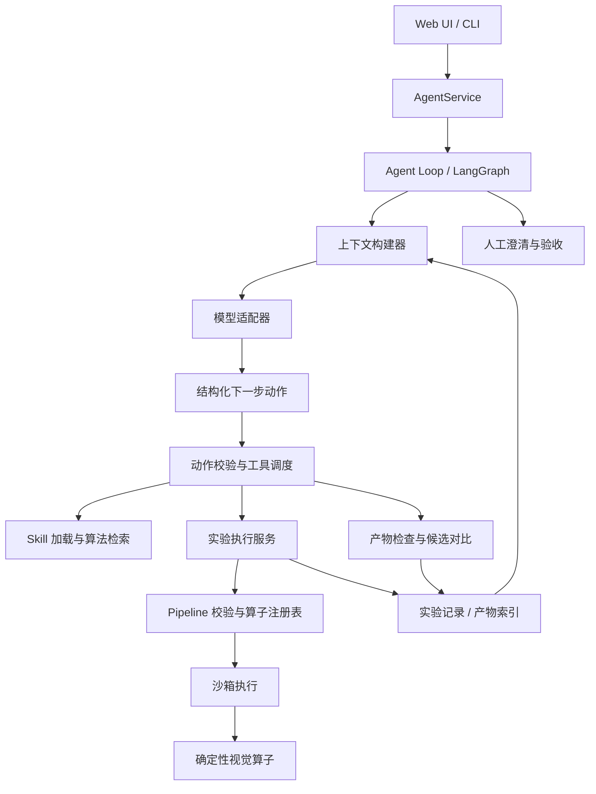

# 视觉算法研发 Agent 架构改造方案

日期：2026-09-19  
状态：设计建议，尚未实施  
范围：Agent Tools、Operators、Skills、Agent Loop、实验记录与现有工程迁移

## 1. 结论与取舍

建议采用 **单个主 Agent + 领域 Skills + Agent 工具与视觉算子 + 确定性视觉执行器 + 持久化实验记录**。

产品的核心能力应当是：面对不理想的检测结果，Agent 能检查证据、提出具体修改、执行实验，并保留此前最好的一版。工具数量、工作流节点数量和模型自由度都不直接代表这个能力。

继续使用 LangGraph 管理状态、循环和人工暂停。模型负责提出实验和决定下一步检查什么；程序负责校验、执行、预算、数据保存与权限。初期不引入多 Agent、向量数据库、远程工具服务或自主扩充 Skill 的机制。

优先补齐实验闭环，然后再逐步开放动作选择。不要同时重写视觉算法、工作流和 UI，否则难以判断效果变化来自哪里。

## 2. 初始审阅（历史基线）

以下保留最初的结构性审阅；当前实现以第 15 节为准，后续章节中的未勾选目标不代表全部已实现。

| 现有实现 | 判断 | 改造方式 |
|---|---|---|
| `core/operators/registry.py` | 已有版本、命名输入端口及产物类型检查 | 保留，补充统一参数 Schema |
| `core/operator_catalog.py`、`core/pipelines/dsl.py` | 已有算子可见性、DAG 校验和模型目录；模型参数目录主要来自函数签名的名称和默认值 | 统一注册定义、模型目录和运行校验的数据来源 |
| `core/sandbox.py` | 已有隔离执行及限制 | 保留，补充统一错误和产物导出契约 |
| `core/skills/registry.py` | Skill 已有适用条件、验证说明和流程模板 | 增加领域说明及诊断方法，按需加载完整内容 |
| `core/agent_graph.py` | 已有复核、修订、人工中断，以及 `experiment_history` 等字段 | 作为唯一编排入口，逐步收敛状态和路由职责 |
| `core/agent_loop.py` | 已有 hypothesis、Pipeline 指纹、候选执行、反馈约束和结果记录 | 将候选执行拆成服务；把历史、预算和去重提升到任务运行范围 |
| `providers/vision.py` | 同时包含模型通信、提示词构建、业务归一化 | 拆出上下文构建及领域协议，保留供应商适配 |
| `core/task_store.py` | 已有任务、消息、记忆、反馈和结果恢复能力 | 增加实验与产物索引，不再创建另一个独立任务存储体系 |
| `core/agent_events.py` | 使用全局监听器发送进度 | 改为按 run_id 隔离，避免同时运行任务时事件混杂 |
| LangGraph `MemorySaver` | 进程内可以恢复中断 | 加入持久化检查点；磁盘结果恢复不等于图执行恢复 |

现有系统已经具备实验闭环的一部分。主要问题是这些能力分散在图节点、候选执行、Provider 和文件记录中，缺少清晰的统一协议。改造重点应是职责收敛和可验证的能力补充。

## 3. 目标依赖关系



依赖规则：

- UI 调用 AgentService，不直接编排模型与算子。
- Provider 处理请求、响应与供应商差异，不写任务文件、不决定算法验收。
- Tool 返回结构化结果，不自行启动新的 Agent 循环。
- Skill 提供领域知识与模板，不绕过执行器运行代码。
- 图状态保存引用和决策摘要；大图像、Mask 和完整实验存储在产物层。
- 同一运行的调度串行推进，先把状态一致性做好；候选并发以后再考虑。

## 4. Tools 怎么改

### 4.1 Agent Tool 与 Operator 分工

本文统一使用 Agent Tool（工具）、Operator（算子）、Skill（技能模板）。只有模型交互接口称为工具；Pipeline 节点中的图像操作称为算子。

**视觉算子层**继续使用现有 `core/operators/`，例如 normalize、threshold、morphology。它们负责处理图像，不需要每一步都请求模型。

**Agent 工具层**提供下面五个初始操作：

| 工具 | 输入 | 输出 |
|---|---|---|
| `query_operators` | 算子名称列表 | 参数、版本及输入输出定义 |
| `load_skill` | Skill 名称与版本 | 说明、模板、依赖及检查建议 |
| `execute_pipeline` | Pipeline、假设、来源、父实验 ID | 实验 ID、结果摘要、产物引用、结构化错误 |
| `inspect_artifact` | 产物 ID、可选裁剪区域 | 可供模型查看的图像及坐标映射 |
| `compare_candidates` | 实验 ID 列表、检查项目 | 对齐的对比图、事实统计和差异 |

历史算法检索目前固定在 `core/agent_graph.py` 中执行，不提供 `search_algorithms` 工具。

`compare_candidates` 负责生成对比材料；是否更准确由模型视觉复核及用户判断，不由工具编造统一质量分数。

模型编写 Pipeline 时仍需知道视觉算子的输入、参数及输出。第一版可保留全部内置算子的紧凑目录，无需为了“按需加载”增加大量检索轮次。

### 4.2 目标工具契约（当前子集见第 15 节）

定义 `ToolSpec` 和 `ToolResult`。初期使用 Python 内部接口即可，不需要上 MCP 或 HTTP。

```python
@dataclass(frozen=True)
class ToolSpec:
    name: str
    version: str
    description: str
    input_schema: dict
    output_schema: dict
    effect: str  # read / experiment_write / publish
    timeout_seconds: float
```

注册时同时绑定执行函数。模型只接收公开 Schema；执行函数、文件根目录和发布授权由运行时控制。

统一结果示意：

```json
{
  "call_id": "call_004",
  "status": "success",
  "data": {
    "experiment_id": "exp_003",
    "statistics": {"component_count": 12, "coverage": 0.08}
  },
  "artifacts": [
    {"id": "artifact_overlay_003", "kind": "overlay"},
    {"id": "artifact_residual_003", "kind": "image"}
  ],
  "warnings": [],
  "error": null
}
```

错误至少区分：`invalid_arguments`、`pipeline_invalid`、`timeout`、`resource_limit`、`execution_failed`、`artifact_missing`。附带字段位置和是否允许重试。空 Mask 是一次有效执行的结果，可以触发诊断，不应一律视为工具故障。

### 4.3 统一参数定义

将算子的参数类型、默认值、上下界和枚举放进注册定义。让以下环节读取同一份定义：

1. 发给模型的工具目录。
2. Pipeline 静态校验。
3. 工具运行前的参数校验。

跨参数约束和产物兼容性保留专门验证函数。不要只依赖 JSON Schema，也不要在提示词和执行代码中分别维护两套取值范围。

示例：高斯去噪的 sigma 应定义为 number，并明确允许范围；morphology 的 method 应列出可用枚举。具体范围沿用现有算法契约，避免重构时悄悄改变合法输入。

### 4.4 中间产物

`execute_pipeline` 默认保留最终 Mask、叠加图和关键中间图；调用方可声明额外需要保留的节点。初期给保留节点数量、总像素及总字节设置限制，避免每次保存所有数组。

产物元数据至少包括：所属任务、输入图像哈希、实验 ID、节点 ID、类型、尺寸、坐标系、文件校验和。裁剪产物必须记录原图偏移及缩放比例。展示灰度归一化图时保留原始数据，不能用展示图替代测量输入。

沙箱到主进程的序列化需要同步支持被选中的中间产物；不能只加产物索引而未真正导出数据。

## 5. Skills 怎么改

### 5.1 一个 Skill 是领域方法包

建议使用以下结构：

```text
skills/periodic_particle/
  skill.json
  instructions.md
  pipeline.json
  examples/
```

现有 `workspace/skills/` 作为用户接受的扩展目录继续支持。系统方法包可放在 `core/skills/builtin/`。旧的 skill.json 格式通过适配器读取。

`skill.json` 记录：名称、版本、用途、适用条件、不适用条件、工具依赖与版本要求、资源路径。`instructions.md` 说明处理步骤、关键观察、失败诊断和退出条件。`pipeline.json` 提供可编辑起点。

周期颗粒 Skill 应明确以下诊断：

| 观察到的问题 | 优先检查 | 可能的下一步 |
|---|---|---|
| 正常条纹被大面积标出 | 背景模型与残差图 | 检查周期方向、周期长度或背景构造 |
| 小颗粒漏检 | 阈值前后的图及连通域过滤结果 | 调整阈值或最小面积 |
| 图像边缘出现异常带 | 有效区域和边界处理 | 调整边界有效范围 |
| 颗粒内部破碎 | 清理前后的 Mask | 评估闭运算或填孔，同时检查是否合并邻近目标 |

这些是建议，需要结合当前证据使用，不写成“遇到漏检就降低阈值”的强制规则。

### 5.2 加载与版本

初始上下文只放 Skill 摘要。模型选择后再读取全文和模板；同一 run 内固定版本及内容哈希，磁盘 Skill 后续修改不影响正在运行的任务。

加载时校验模板所用算子、输入输出和声明依赖一致。现有模板的依赖清单应一并核对，避免清单只列部分算子。

Skill 的 `verification` 拆成两种：程序可执行检查，以及模型需要进行的视觉检查。描述了某项检查不代表运行时已经执行；检查结果要记录到实验中。

### 5.3 经验的三个层次

- 实验：一次运行，无论失败或成功都记录。
- 已接受算法：用户确认过的一次具体方案，记录适用输入与约束。
- Skill：多个任务中被验证并经整理的通用方法。

接受算法不自动创建 Skill，也不自动发布生成算子。保留现有生成算子的隔离与显式测试发布边界；第一期不扩大生成代码能力。

## 6. Agent Loop 怎么改

### 6.1 保留框架，逐步开放下一步动作

第一阶段继续使用原有“规划—执行—复核—修订”图，只把执行和记录替换成统一服务。稳定后，再收敛为：

```text
prepare → build_context → decide → validate_action
                              ↑          ↓
                          observe ← execute_tool
                                         
有效终结动作 → wait_for_human → 接受 / 新反馈 / 停止
```

`decide` 每次返回一个结构化动作。工具调用与控制动作分开：

```text
call_tool        调用允许的工具
request_input    目标或约束不明确，需要用户澄清
present_result   提交一个已完成实验供用户检查
report_blocked   无法继续，附失败原因和已有可用结果
```

用户接受及发布不作为模型可以自行选择的动作。`present_result` 只表示准备接受检查。

动作示意：

```json
{
  "type": "call_tool",
  "tool": "execute_pipeline",
  "reason": "残差仍包含明显条纹，检查调整周期估计后是否减少正常结构误检。",
  "evidence_ids": ["artifact_residual_003"],
  "arguments": {
    "parent_experiment_id": "exp_003",
    "hypothesis": "周期估计偏差导致背景扣除不充分",
    "pipeline": {"schema_version": 3, "name": "candidate_4", "nodes": [], "outputs": {}}
  }
}
```

上面的 Pipeline 是协议占位，实际调用必须传入能通过校验的完整 DAG。`reason` 记录简短的证据与动作依据，不要求模型输出冗长内部推理。

### 6.2 状态拆分

建议将当前大状态按概念拆成结构化对象：

| 状态 | 内容 |
|---|---|
| TaskContract | 原始目标、样本、测量要求、用户约束及版本 |
| RunState | run_id、状态、下一动作、已加载 Skill、预算 |
| ExperimentSummary | 实验 ID、假设、状态、关键统计、结论和产物引用 |
| ReviewState | 当前选中实验、选择理由、证据、待确认问题 |
| HumanDecision | 用户动作、反馈、针对的实验及任务约束版本 |

结构化状态是事实来源。消息历史是沟通记录，上下文摘要是可重建缓存。图状态中不重复嵌入全部图像、历史 Pipeline 和 previous_state 链。

### 6.3 每轮上下文

提供原始目标与最新约束、工具目录、已加载 Skill、当前最佳候选、最近失败摘要、剩余预算和必要图像。完整记录保留在存储中，需要时再读取。

必须确认产物已被真正转换为模型可见的图像内容；仅把 `artifact_id` 写进提示词不等于模型看到了图。

### 6.4 预算、重复与停止

第一版可使用以下建议默认值，后续根据评测调整：

| 限制 | 建议默认值 |
|---|---|
| 单次自动运行模型调用 | 12 次，包括复核和格式修复 |
| 单次自动运行实验数 | 6 个，包括失败执行和校准候选 |
| 单次自动运行工具调用 | 24 次，限制无效检查循环 |
| 连续无有效进展 | 3 次，提交当前结果或报告阻塞 |
| 总运行时间 | 5 分钟，同时保留单工具超时 |

这些数字是起始建议，不应直接照搬到现有参数中而不做映射。迁移时显式转换 `max_candidates`、`max_auto_revisions` 和独立校准预算，并保证 UI 展示实际剩余预算。

在工具启动前预扣执行额度；失败也保留记录和额度消耗。用户反馈创建新的 run 并显式分配新预算，同一次 run 重启恢复不能重置额度。

实验去重键包含：规范化 Pipeline、算子版本、生成算子源码哈希、输入内容哈希、约束版本和执行相关配置。仅用 Pipeline 指纹不足以区分不同图像或反馈约束。已有完成结果可复用；暂时性基础设施故障可在独立重试上限内重试。

“无进展”至少覆盖重复动作、反复无效参数、重复查看同一证据且无新实验。没有 Ground Truth 时，不用像素统计的变化伪装成准确率改善。

### 6.5 当前最佳结果

新实验不会自动覆盖当前最佳结果。选择动作要记录对比对象、结论及依据。没有可靠依据时保留并列候选；预算耗尽仍展示此前可用结果和未解决问题。

有 Ground Truth 时可按预先声明的指标比较；没有 Ground Truth 时记录视觉复核判断及不确定性，不创建假质量分数。用户修改任务目标后，旧的最佳候选需要按新约束重新检查。

## 7. 实验存储与恢复

### 7.1 统一目录

复用 `TaskStore`，新增下面的逻辑结构：

```text
workspace/tasks/<task_id>/
  task.json
  runs/<run_id>/
    run.json
    events.jsonl
    experiments/<experiment_id>/
      experiment.json
      pipeline.json
      trace.json
      review.json
      artifacts/
```

现有 `outputs/` 结果通过索引引用及兼容导出保留，第一期不搬迁或覆盖旧产物。新产物只设一个权威位置。

实验记录包含父实验 ID、任务约束版本、假设、修改摘要、Pipeline、输入哈希、环境版本、状态、产物索引、错误和用户结论。执行状态和验收状态分开：执行成功不等于结果合格。

### 7.2 持久化与幂等

本地单用户场景建议使用 SQLite 记录运行、实验索引和 LangGraph 检查点，图像继续存在文件系统。引入检查点扩展时固定依赖版本并更新锁文件。

使用稳定的 call_id 标识一次调度，execute_pipeline 重复收到同一 call_id 时返回已保存结果。发布操作也应有幂等键。

文件先写临时路径，再原子重命名，最后提交完成记录。磁盘与数据库无法共享同一事务，因此启动时需要核对：文件未完整写入的实验标记为 interrupted；有完整清单和校验和的结果可以恢复索引。不要把崩溃时状态为 running 的实验直接标为成功。

提交终结动作时保存明确的 human_review 状态。重启后恢复相同 run、预算与待验收实验，不重新执行已完成候选。

## 8. 工程文件怎么拆

以下是逐步演进的目标结构，不要求第一天创建所有空目录：

```text
core/
  agent/
    service.py          # UI/CLI 统一应用入口
    state.py            # 任务、运行、决策与预算结构
    graph.py            # 唯一 LangGraph 编排
    context.py          # 模型上下文及图像选择
    policy.py           # 动作、预算和终结校验
  tools/
    contracts.py        # ToolSpec / ToolResult
    registry.py         # Agent 工具注册与调度
    experiments.py      # 执行、检查及比较工具
    knowledge.py        # Skill 加载、算法检索适配
  experiments/
    runner.py           # 一次候选实验的执行服务
    records.py          # 实验模型及存储适配
    artifacts.py        # 产物保存、裁剪、引用解析
    constraints.py      # 用户反馈约束
  operators/            # 保留视觉算子与注册表
  pipelines/            # 保留 DSL、校验和执行
  skills/               # 扩充现有 Registry 与方法包
  sandbox.py            # 保留隔离执行
  task_store.py         # 任务持久化入口
providers/
  vision.py             # 过渡期兼容入口
  protocols.py          # 模型输入输出协议
  aliyun.py             # 供应商通信适配
```

从 `agent_loop.py` 开始提取 `runner`、`constraints` 和实验存储；候选生成归决策模块，结果选择归复核模块。旧函数保留薄包装，避免一次修改所有调用者。

从 `agent_graph.py` 迁移图编排到 `core/agent/graph.py` 后，旧模块保留兼容导入。不要长期维护两套循环。

Provider 支持结构化动作输出；若当前模型接口不支持原生工具调用，使用受 Schema 校验的 JSON 动作适配。不要为了形式上的 function calling 而绑定某个供应商。

## 9. 分阶段实施与验收

### 阶段一：建立可比较基线与统一实验记录

- 选定现有亮目标、暗目标、周期背景样本，保存基线结果和环境信息。
- 提取单候选实验 Runner，保留现有图的调度方式。
- 为现有 hypothesis、trace、pipeline_diff 和结果文件建立统一实验索引。
- 导出关键中间产物，并为用户反馈约束记录版本。

验收：相同 Pipeline、输入和环境的 Mask 与基线一致；每个成功或失败候选均可追溯；执行职责迁移不改变既有人工验收行为。

### 阶段二：统一工具契约与诊断能力

- 补齐算子 Schema，共用目录与校验。
- 实现五个 Agent 工具，先由现有节点调用。
- 接入图像检查、裁剪坐标映射和候选对比。
- 补齐沙箱中间产物序列化及大小限制。

验收：非法参数在执行前被拒绝；模型能实际查看指定中间图；裁剪可映射回原图；工具失败有稳定错误码；调用超时不阻塞整个任务。

### 阶段三：整理三个高质量 Skills

- 将亮目标、暗目标和周期颗粒模板整理为方法包。
- 加入适用条件、诊断方法与视觉检查清单。
- 对齐依赖清单和模板实际使用的算子。
- 记录加载版本及内容哈希。

验收：仅加载选中的完整 Skill；缺失依赖或无效模板会明确失败；旧 Skill 记录仍可读取；修改方法包后，已有实验仍可追溯原内容。

### 阶段四：引入结构化动作循环

- 增加 decide、validate_action、execute_tool、observe。
- 统一运行预算、重复实验检查和当前最佳结果管理。
- 接入 request_input、present_result 和 report_blocked。
- 用可配置开关切换新循环，默认值在验收通过后再切换。

验收：能够主动检查中间结果后修订；新一轮退化不会丢失旧结果；重复调用和格式修复均受预算约束；没有用户确认不会发布；终结动作引用真实完成的实验。

### 阶段五：持久化恢复与 UI 接入

- 接入持久化检查点和幂等执行记录。
- 事件带上 task_id、run_id、call_id、experiment_id，按运行隔离。
- UI 展示当前实验、修改摘要、对比结果和剩余预算。
- 保持 CLI 与 UI 共用 AgentService。

验收：重启后可继续人工验收；已完成实验不重复执行；崩溃中的实验可识别；重复接受不会重复发布；两个任务的进度不会混杂。

## 10. 测试与效果评估

重用现有 `test_operators.py`、`test_pipeline_dsl.py`、`test_sandbox.py`、`test_agent_graph.py`、`test_agent_loop.py`、`test_skills.py`、`test_task_store.py` 和 UI 测试。按阶段运行相关用例，合并新循环前再执行完整回归。

新增测试重点放在行为边界：

1. 未知工具、非法参数、错误产物类型在运行前失败。
2. 检查中间图后修改实验，证据和父实验关系完整。
3. 新实验变差或失败时，旧候选仍可提交验收。
4. 重复实验、连续无效动作、工具超时和预算耗尽能够停止。
5. 用户修改约束后，去重键及最佳候选检查随之变化。
6. 重启恢复、重复调用和重复接受不会造成重复执行或发布。
7. 生成算子及旧版 Pipeline 的既有约束保持有效。

用脚本化 Mock Provider 验证循环协议，不用真实模型测试确定性路由。视觉效果另做固定样本评测，记录用户接受率、失败率、模型调用数、耗时，以及有独立 Ground Truth 时的指标。

校准数据与独立评估数据必须区分。若当前任务用 Ground Truth 调过参，该数据上的结果只能报告为校准结果；评估泛化能力时 withheld Ground Truth 不进入模型、检索、调参或候选选择。

## 11. 第一批实际开发任务

建议第一批只完成阶段一，形成可独立合并的变更：

- [ ] 定义 ExperimentRecord、ArtifactRef 和执行状态。
- [ ] 提取单候选 Runner，复用现有沙箱、测量、渲染和约束逻辑。
- [ ] TaskStore 增加实验索引及稳定 ID。
- [ ] 保存残差、阈值前后等被选中的中间产物。
- [ ] 原有图通过适配层调用 Runner，保持现有 API 和输出兼容。
- [ ] 对关键样本验证 Mask 一致性和失败记录完整性。

第一批完成后，再让模型使用 inspect_artifact。这样每一步都有明确收益，也有可比较的回归边界。

## 12. 最终验收场景

输入一张周期背景上的颗粒图，第一版检测将正常条纹误标。系统能够展示并检查残差图，记录“周期背景未充分去除”的假设，修改相应 Pipeline 节点并执行。若修改失败，它仍保留旧的有效候选；若改进有效，它展示前后对比并请求用户验收。

用户补充“右侧小颗粒漏检”后，系统保留原始任务目标，将反馈作为新的约束版本继续实验。重启应用后，这些证据、实验关系和待验收状态仍然存在。达到这个场景，才说明 Tools、Skills 和 Agent Loop 真正形成了可用的架构。

## 13. 首批实现记录（历史快照，2026-09-19）

本轮完成了渐进式披露及实验可检查性的纵向接入，并未完成上文全部五个阶段。

已实现：

- `core/tools/discovery.py` 提供 `query_operators`、`load_skill`、`inspect_artifact`。30 个内置算子仍在库中，初始提示词只提供名称和描述，详细端口与参数按需批量查询。
- 当前通过结构化 JSON 动作接入 Aliyun 任务理解与修订请求，无需供应商支持原生函数调用。每次任务理解最多执行 3 次查询，最终输出允许 2 次校验机会；这是局部预算，尚不是统一运行预算。
- 加载 Skill 同时返回模板、诊断说明和所需算子定义，三个内置 Skill 已补充诊断建议并核对算子依赖。
- 沙箱返回有界的中间图像与 Mask，最多 8 个、数组合计 32 MiB。优先保留名称含 residual 的产物及 Mask；超限产物跳过。该上限仅限制新增中间数组，不代表整个沙箱返回值大小。
- 每个候选目录新增 `experiment.json`，记录成功、失败或重复候选的执行快照、输入哈希、父实验引用、假设及产物索引。
- 中间产物保存原始 `.npy` 和最长边不超过 1024 的 PNG 预览，并记录灰度显示范围和缩放比例。预览明确属于应用用户约束之前的 Pipeline 输出。
- 模型通过当前修订上下文内的产物 ID 查询图像，不能把任意文件路径作为查询参数。图像实际加入后续模型请求。
- 无可用新候选时，终结流程可以恢复历史可展示结果。没有 Ground Truth 时仅声明是回退结果，不声明它是准确率最高的结果。

尚未完成：单候选 Runner 的全面拆分、统一参数 Schema、独立比较工具、全局动作循环和预算、跨运行去重、持久化 LangGraph 检查点、UI 实验对比面板。`experiment.json` 当前是执行快照，其中 pending 验收状态不会自动同步；用户最终验收仍以现有 TaskStore 的验收记录为准。运行环境仍写在原有 iteration 目录。

验证：`.venv/bin/python -m pytest -q`，205 项通过。新增覆盖批量查询、Skill 依赖、产物原始数据与范围限制、查询预算、沙箱数组传输、失败实验追溯及历史结果回退。使用 Mock 验证模型协议，未调用付费模型 API，也未声称检测准确率有所提高。当前本地虚拟环境为 Python 3.14，测试有现有 Pydantic 兼容性及依赖弃用警告；README 声明的基线仍为 Python 3.12。

测试退出补充：全量测试输出 `205 passed` 后进程仍未退出，已发送 SIGINT 清理；因此本次验证为所有测试断言通过，进程自然退出未通过验证。残留原因未在本次定位，不能将其认定为某个具体依赖的问题。

## 14. 执行与对比 Tool 接入（历史快照，2026-09-19）

新增 `core/tools/experiments.py`，现在 Agent 可调用五个工具：`query_operators`、`load_skill`、`inspect_artifact`、`execute_pipeline`、`compare_candidates`。

### execute_pipeline

参数：完整 `pipeline`、可选 `hypothesis`、可选 `parent_experiment_id`。输入图片、输出目录及用户反馈由运行时提供，模型不能自行指定路径。复用现有候选执行器、DSL 校验、生成算子校验、沙箱及用户 include/exclude 约束，不自动发布算法。返回实验 ID、事实统计、中间产物和可见叠加图。空 Mask 是可诊断结果；无效流程和执行失败保留失败记录。

每次任务理解或修订最多启动 2 个新实验，失败也消耗额度。同一会话内相同流程及版本复用执行结果，版本无效不能命中成功缓存。每次调用的产物位于 `<output_root>/agent_experiments/<session_id>/`，包含执行记录和 session.json。

### compare_candidates

参数：`experiment_ids`，2 到 3 个不同 ID，只能来自当前工具会话或运行时传入的上一轮实验。读取实验清单校验原图哈希、执行状态及像素尺寸；跨图片、失败实验和未知 ID 会拒绝比较。

返回对齐的并排叠加图、候选流程与假设、事实统计，以及相对于第一个候选的新增、删除和变化像素数。包含反馈约束供模型核对；像素变化量不作为准确率或自动验收分数。每轮最多调用 2 次。

### 调度与限制

模型以结构化 JSON `call_tool` 发起操作。每轮最多 3 次查询类调用、4 次实验类调用，总模型交互有 10 轮硬上限并保留 2 次无效最终输出处理机会。工具事件接入现有进度通道。最终任务理解结果记录 tool_session 索引。

这些实验属于规划期探索，最终 candidate_pipelines 仍由正式工作流再次校验、执行并进行人工验收。探索实验预算与原有候选/校准预算分别计数，不宣称已实现全局预算或跨阶段执行复用。相比此前可能增加模型调用与执行耗时。

测试覆盖：执行结果复用、版本校验不被缓存绕过、用户排除约束、失败实验额度和记录、产物后续查看、对齐对比图、差异统计、跨图片/未知/失败实验拒绝，以及模型“执行两次→对比→输出候选”的完整 Mock 协议。不调用真实付费模型。


## 15. 当前实现：协议、预算、Runner 与 Skill 修复

前面的设计草案与第 13、14 节阶段记录保留用于追溯；当前行为如下：

| 关注点 | 已实现 | 尚未实现或边界 |
|---|---|---|
| 调用协议 | 默认原生 function calling，支持流式参数拼接、调用 ID、tool 回复；显式 text 兼容模式 | 未用真实付费端点验证；不自动降级 |
| 工具契约 | contracts.py 定义五个 ToolSpec、参数校验和 ToolResult；错误含 code/message/retryable | 尚无每个工具独立输出 JSON Schema、统一可中断执行超时；Pipeline 沙箱仍有硬超时 |
| 规划循环 | planning.py 管理 10 轮交互与最终输出阶段，最后两轮保留给收尾 | 提示词构建、最终领域归一化仍保留在 provider 文件 |
| 预算 | budget.py 是单次规划的计数来源，dispatcher 强制校验；查询 3、检查 3、新实验 2、对比 2、实验调用共 4 | 正式候选、校准和多轮修订未合并为全任务预算 |
| 单实验执行 | experiments/runner.py 被正式工作流和实验工具共用；tools/runner 不依赖 agent_loop/provider | 候选选择、历史回退、验收仍属于工作流 |
| Skill | Schema、模板、依赖校验；显式版本加载、同名多版本、缓存失效；unknown 仅兜底；移除默认数量上限 | verification 仍有描述性检查，未声称全部自动执行；无自动 Skill 发布 |
| 历史算法 | agent_graph 固定检索、注入候选基线 | 未实现自主 search_algorithms 工具，也非本次必要目标 |

工具错误码包括 invalid_arguments、unknown_tool、budget_exhausted、pipeline_invalid、timeout、resource_limit、worker_terminated、execution_failed、artifact_missing、io_error。预算耗尽不占用最终 JSON 校验失败次数，不再反馈成“安全校验失败”。部分预算耗尽只禁用对应工具；全部耗尽、探索轮次达到上限或反复请求不可用工具时进入最终输出阶段，原生请求使用 tool_choice=none，运行时也拒绝任何工具动作。

配置：ALIYUN_TOOL_MODE=native 为默认；仅当端点不支持原生协议时显式设置 text。两种传输使用同一参数契约、调度和预算。原生工具结果中的图像通过后续 user 多模态消息提供，确保先完成所有 tool_call_id 的回复。

Skill 文件按 name/version 标识。内置版本不可覆盖；同名更高版本可并存，未指定版本时选择最高版本。重复或非法文件跳过并记录诊断；缓存以文件修改/变更时间和大小失效。该缓存范围是 Registry 实例，不是跨进程数据库。

本轮验证：全量测试输出 `234 passed`，覆盖原生流式调用与调用 ID 回复、文本兼容协议、预算分组禁用与最终收尾、参数/JSON/执行错误分类、超时失败不缓存、正式工作流和实验共用 Runner、Skill Schema/依赖/版本/缓存/兜底，以及既有检测回归。未调用真实付费模型。测试汇总后进程仍未自然退出，已发送 SIGTERM 清理；进程退出问题仍未解决。`git diff --check` 通过。
